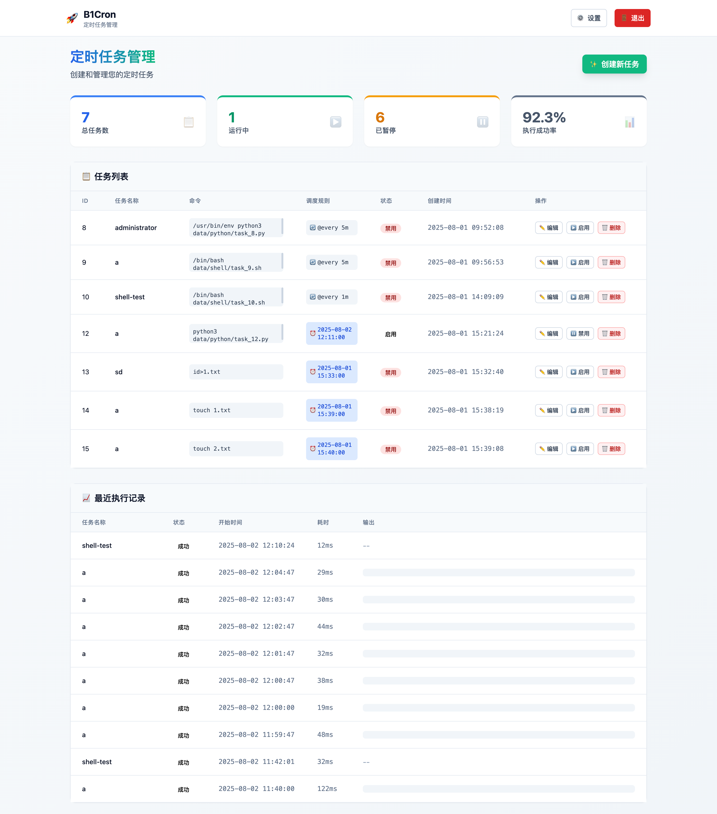
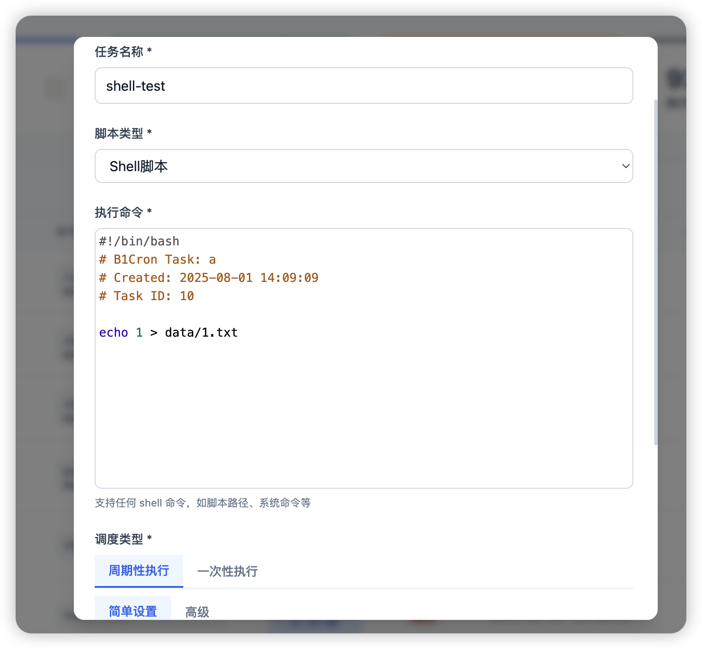

# B1Cron 🚀

<div align="center">

**现代化定时任务管理系统**  
**Modern Cron Job Management System**

[](https://golang.org)
[](LICENSE)
[](https://docker.com)

[English](#english) | [中文](#中文)

</div>

---

## 中文

### 🌟 项目简介

B1Cron 是一个现代化的定时任务管理系统，使用 Go 语言构建。提供简洁的 Web 界面，用于创建、管理和监控定时任务，支持实时执行监控和历史记录查看。

### ✨ 核心特性

- **📋 任务管理**: 创建、编辑、删除、启用/禁用定时任务
- **⚡ 灵活调度**: 支持周期性执行（Cron 表达式、@every 间隔）和一次性执行
- **📊 执行监控**: 实时查看任务执行状态、成功率和历史记录
- **🔐 安全认证**: JWT 身份验证，默认账号 admin/admin
- **🎨 现代界面**: 响应式设计，简洁的浅色主题界面
- **💾 数据持久化**: SQLite 数据库存储，支持任务自动恢复
- **🐳 Docker 支持**: 一键部署，开箱即用

### 🛠️ 技术栈

- **后端**: Go 1.21, Gin, GORM, SQLite
- **调度器**: go-co-op/gocron v2
- **前端**: HTMX, 模块化 JavaScript 组件架构, Tailwind CSS, SimpleToast
- **认证**: JWT + gin-jwt
- **容器化**: Docker, Docker Compose

### 🚀 快速开始

#### 方式一：Docker 部署（推荐）

```bash
# 克隆项目
git clone <repository-url>
cd b1cron

# 启动服务
docker-compose up -d

# 查看日志
docker-compose logs -f
```

#### 方式二：本地运行

```bash
# 环境要求：Go 1.21+
git clone <repository-url>
cd b1cron

# 安装依赖
go mod download

# 运行服务
go run cmd/app/main.go
```

访问 http://localhost:8080，使用 `admin/admin` 登录。

### 📋 功能演示

#### 任务列表
- 查看所有定时任务的运行状态
- 实时显示任务统计：总数、运行中、已暂停、成功率



#### 创建/编辑任务

**调度类型支持**：
- **周期性执行**: 定期重复运行的任务
  - **简单模式**: 选择执行频率（每N分钟/小时、每天、每周）
  - **高级模式**: 直接输入 Cron 表达式或 @every 格式
- **一次性执行**: 在指定时间执行一次的任务，执行后自动完成



**脚本类型支持**：
- **直接命令**: 系统命令或可执行程序
- **Shell 脚本**: 保存为 .sh 文件并执行
- **Python 脚本**: 保存为 .py 文件并执行

**代码编辑器**: CodeMirror 编辑器，支持语法高亮和多行编辑

#### 执行监控
- 最近执行记录列表，显示执行状态、耗时、输出
- 点击记录查看详细执行信息（输出、错误、时间等）
- 执行统计图表和成功率分析

### 📝 脚本类型支持

```bash
# 直接命令执行
echo "Hello World"
curl -s https://api.example.com/ping

# Shell 脚本
#!/bin/bash
echo "Running shell script"
# 脚本会保存为 .sh 文件并执行

# Python 脚本  
#!/usr/bin/env python3
print("Running Python script")
# 脚本会保存为 .py 文件并执行
```

### 📝 调度格式支持

#### 周期性执行

```bash
# Cron 表达式（分 时 日 月 周）
30 9 * * *          # 每天 9:30
0 */2 * * *         # 每2小时
15 14 1 * *         # 每月1日 14:15

# @every 间隔格式
@every 5m           # 每5分钟
@every 1h           # 每1小时
@every 30s          # 每30秒
```

#### 一次性执行

```bash
# 通过 Web 界面选择具体的执行时间
# 例如：2024-01-15 14:30:00
# 任务会在指定时间执行一次，执行后自动完成
```

### 🗂️ 项目结构

```
b1cron/
├── cmd/app/                 # 应用入口
├── internal/
│   ├── auth/               # JWT 认证
│   ├── database/           # 数据库连接
│   ├── handler/            # HTTP 处理器
│   ├── models/             # 数据模型
│   ├── scheduler/          # 任务调度器
│   └── service/            # 业务逻辑
├── static/                 # 静态资源
│   ├── css/               # 样式文件
│   └── js/                # JavaScript 模块
│       ├── components.js  # 组件注册管理
│       ├── task-form.js   # 任务表单组件
│       ├── tab-manager.js # 标签页管理
│       ├── schedule-*.js  # 调度相关组件
│       └── code-editor.js # 代码编辑器组件
├── templates/              # HTML 模板
├── Dockerfile             # Docker 构建文件
├── docker-compose.yml     # Docker Compose 配置
└── data/                  # 数据目录（SQLite）
```

### 🐳 Docker 配置

**Dockerfile**: 多阶段构建，最终镜像 ~50MB
**docker-compose.yml**: 简化配置，包含数据持久化

### 🔧 配置说明

- 数据库文件：`./data/b1cron.db`
- 默认端口：8080
- 自动重启：是
- 数据持久化：通过 volume 挂载

---

## English

### 🌟 Overview

B1Cron is a modern cron job management system built with Go. It provides a clean web interface for creating, managing, and monitoring scheduled tasks with real-time execution monitoring and history tracking.

### ✨ Features

- **📋 Task Management**: Create, edit, delete, enable/disable scheduled tasks
- **⚡ Flexible Scheduling**: Support for periodic execution (Cron expressions, @every intervals) and one-time execution
- **📊 Execution Monitoring**: Real-time task execution status, success rate, and history
- **🔐 Secure Authentication**: JWT authentication with default admin/admin credentials
- **🎨 Modern UI**: Responsive design with clean light theme interface
- **💾 Data Persistence**: SQLite database with automatic task recovery
- **🐳 Docker Support**: One-click deployment, ready to use

### 🚀 Quick Start

#### Option 1: Docker Deployment (Recommended)

```bash
git clone <repository-url>
cd b1cron
docker-compose up -d
```

#### Option 2: Local Development

```bash
# Requirements: Go 1.21+
git clone <repository-url>
cd b1cron
go mod download
go run cmd/app/main.go
```

Visit http://localhost:8080, login with `admin/admin`.

### 📋 Screenshots

#### Dashboard View
Real-time task management with execution monitoring and statistics.


#### Task Editor
Create and edit tasks with flexible scheduling options.


### 🛠️ Script Type Support

```bash
# Direct command execution
echo "Hello World"
curl -s https://api.example.com/ping

# Shell scripts
#!/bin/bash
echo "Running shell script"
# Scripts are saved as .sh files and executed

# Python scripts  
#!/usr/bin/env python3
print("Running Python script")
# Scripts are saved as .py files and executed
```

### 📋 API Endpoints

| Method | Endpoint | Description |
|--------|----------|-------------|
| `GET` | `/dashboard` | Main dashboard |
| `POST` | `/api/tasks` | Create task |
| `GET` | `/api/tasks` | List all tasks |
| `PUT` | `/api/tasks/:id` | Update task |
| `DELETE` | `/api/tasks/:id` | Delete task |
| `PATCH` | `/api/tasks/:id/toggle` | Toggle task status |
| `GET` | `/api/tasks/:id/executions` | Get task executions |
| `GET` | `/api/executions/recent` | Get recent executions |
| `POST` | `/api/change-password` | Change user password |

### 📝 Schedule Formats

#### Periodic Execution

```bash
# Cron expressions (minute hour day month weekday)
30 9 * * *          # Daily at 9:30 AM
0 */2 * * *         # Every 2 hours
15 14 1 * *         # 1st of month at 2:15 PM

# @every interval format
@every 5m           # Every 5 minutes
@every 1h           # Every 1 hour
@every 30s          # Every 30 seconds
```

#### One-time Execution

```bash
# Select specific execution time via Web interface
# Example: 2024-01-15 14:30:00
# Task executes once at specified time and auto-completes
```

---

<div align="center">

**Made with ❤️ using Go & HTMX**

⭐ **如果这个项目对你有帮助，请给个 Star！**  
⭐ **If this project helps you, please give it a Star!**

</div>